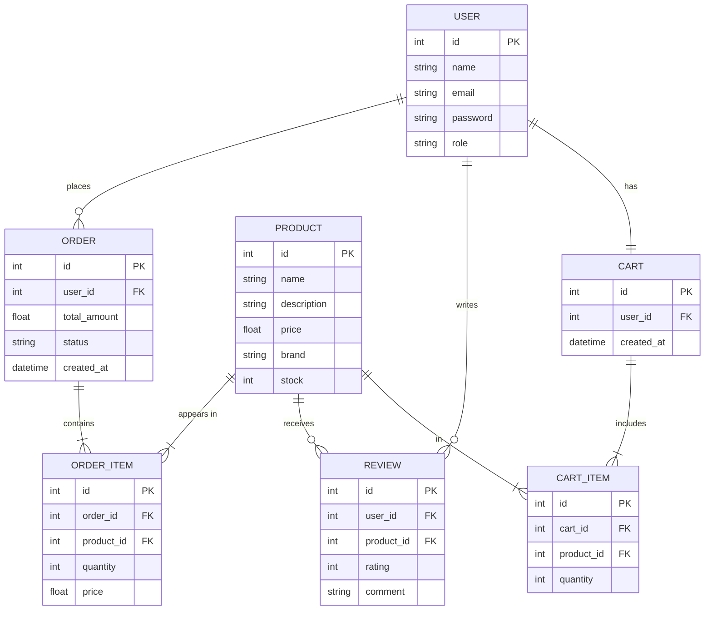

```mermaid
erDiagram
  USER ||--o{ ORDER : places
  ORDER ||--|{ ORDER_ITEM : contains
  PRODUCT ||--|{ ORDER_ITEM : "appears in"
  USER ||--o{ REVIEW : writes
  PRODUCT ||--o{ REVIEW : receives
  USER ||--|| CART : has
  CART ||--|{ CART_ITEM : includes
  PRODUCT ||--|{ CART_ITEM : in

  USER {
    int id PK
    string name
    string email
    string password
    string role
  }

  PRODUCT {
    int id PK
    string name
    string description
    float price
    string brand
    int stock
  }

  ORDER {
    int id PK
    int user_id FK
    float total_amount
    string status
    datetime created_at
  }

  ORDER_ITEM {
    int id PK
    int order_id FK
    int product_id FK
    int quantity
    float price
  }

  REVIEW {
    int id PK
    int user_id FK
    int product_id FK
    int rating
    string comment
  }

  CART {
    int id PK
    int user_id FK
    datetime created_at
  }

  CART_ITEM {
    int id PK
    int cart_id FK
    int product_id FK
    int quantity
  }

```